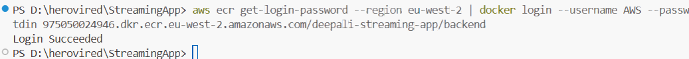
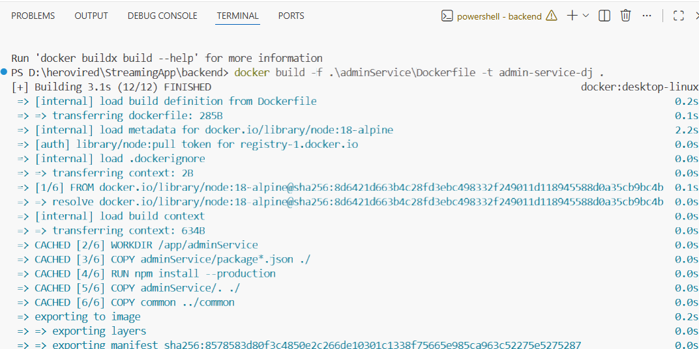
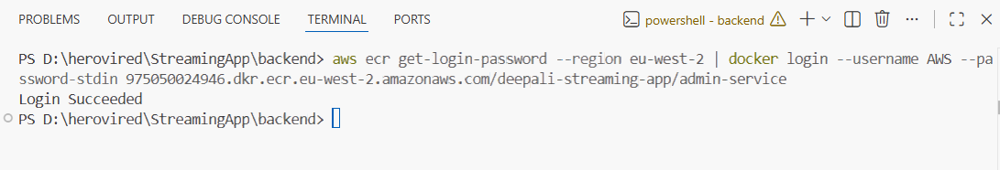
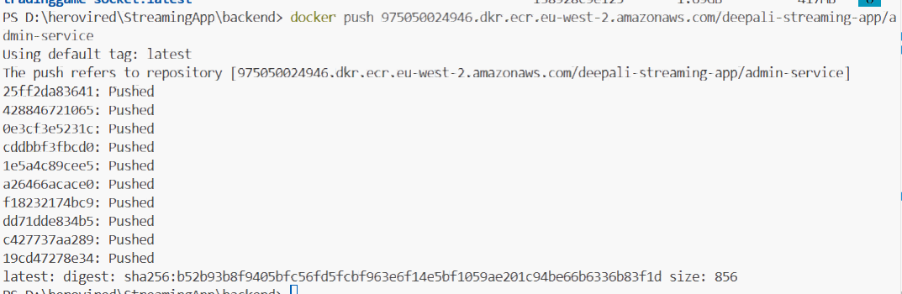
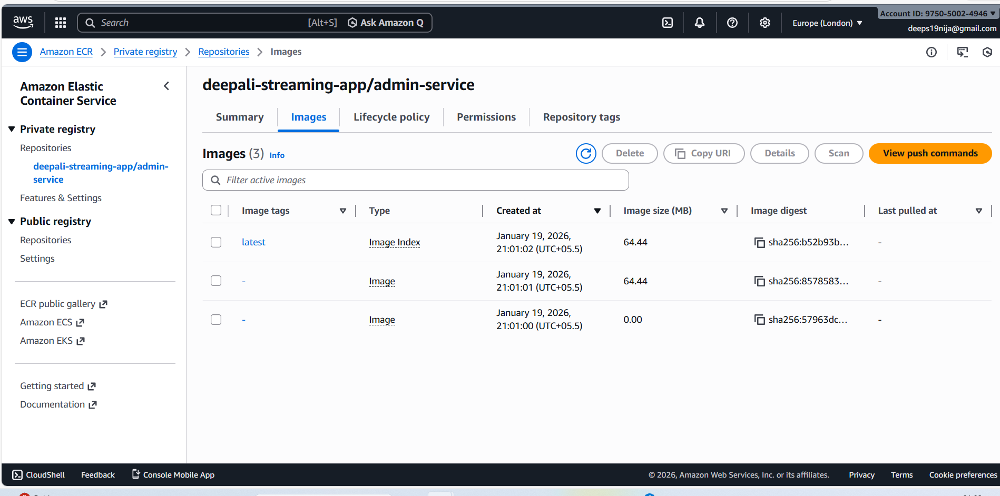
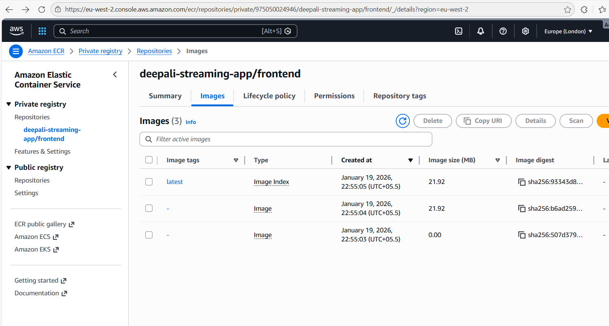
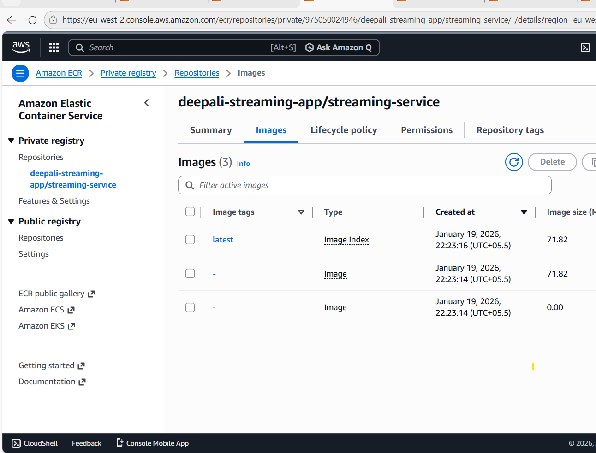
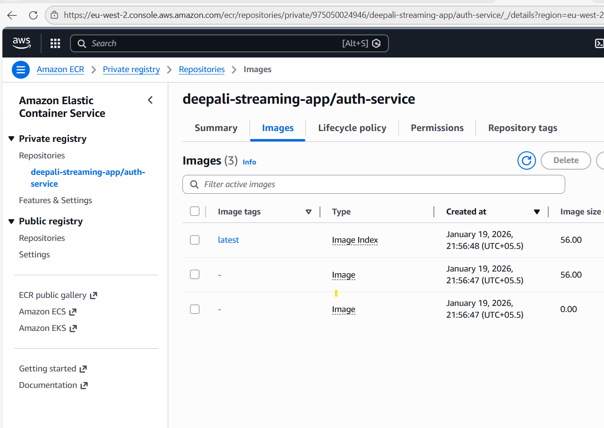
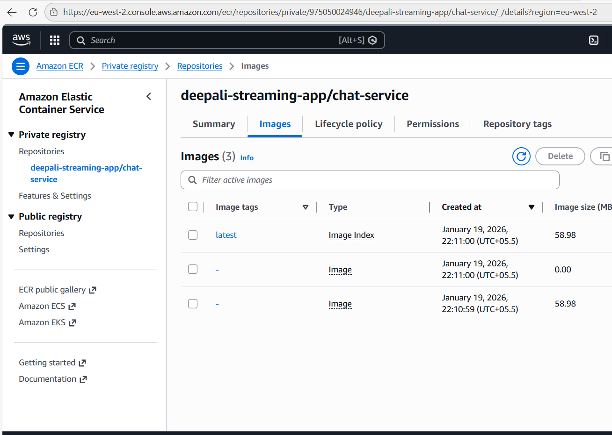

Created the ECR repository

Build the dockerfile for each service like admin-service  

Now, login to Docker using ECR repo  
  

After login succedded, tag and push the docker image created locally to ecr repository.

Do the same steps for rest of the services and push the images to ECR repos 

