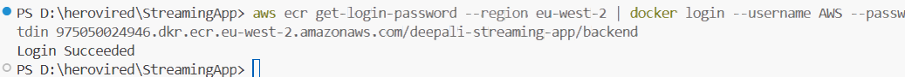
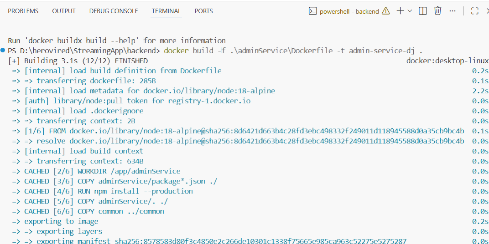
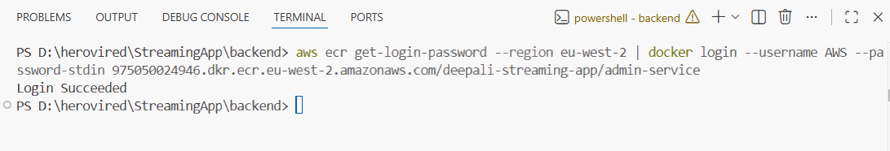
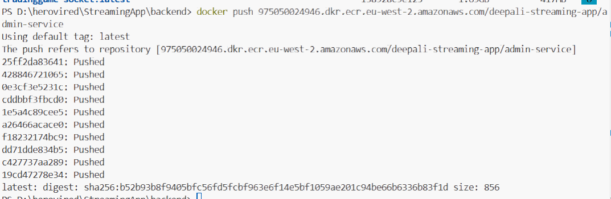
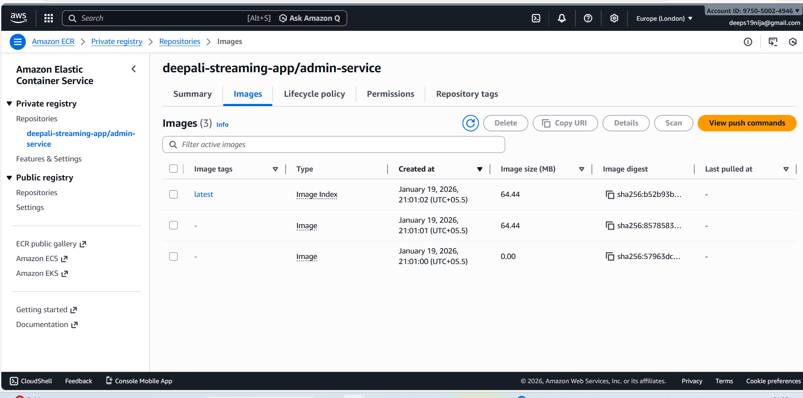
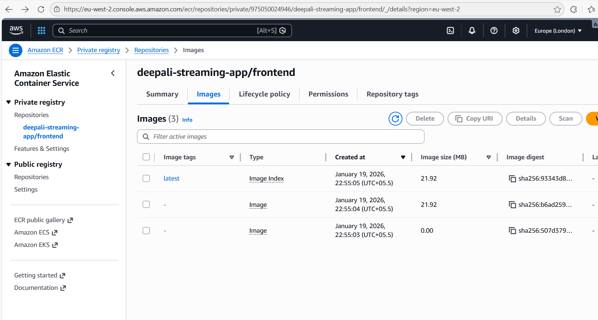
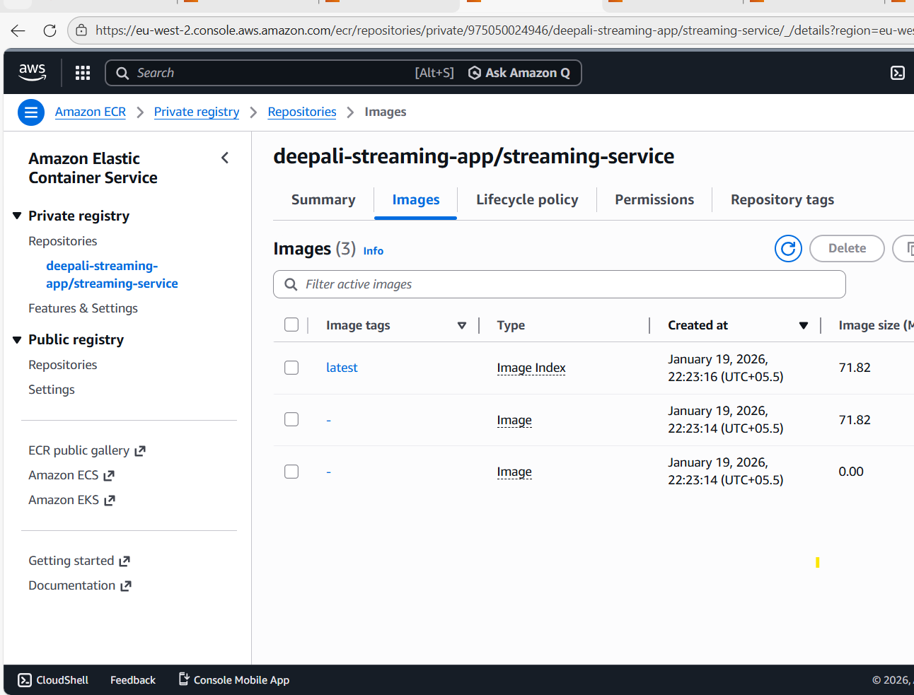
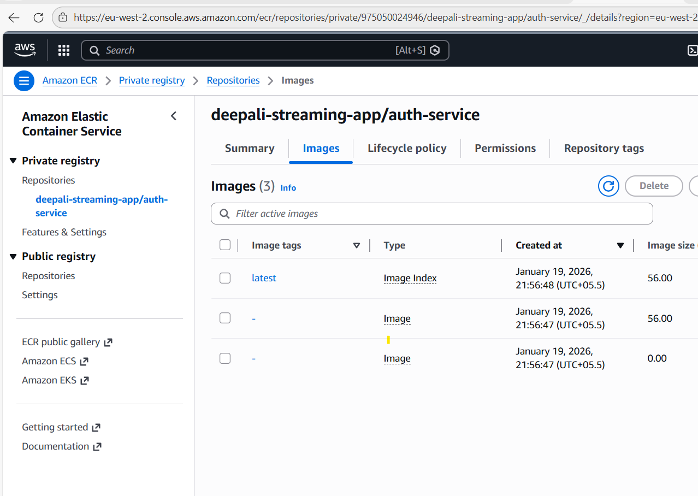
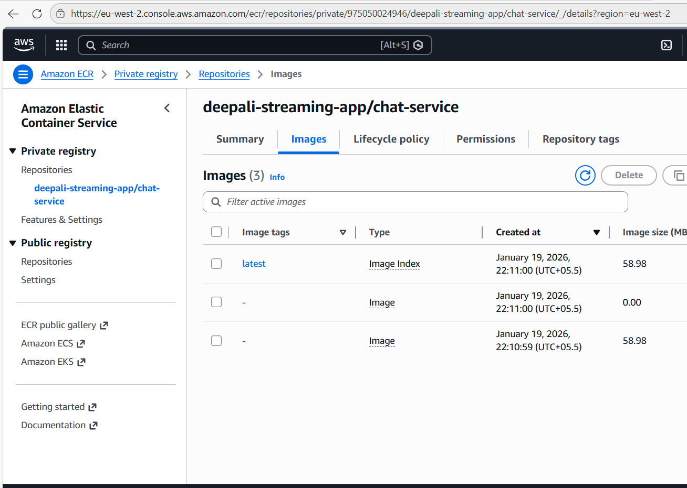

Created the ECR repository

Build the dockerfile for each service like admin-service  

Now, login to Docker using ECR repo  
  

After login succedded, tag and push the docker image created locally to ecr repository.

Do the same steps for rest of the services and push the images to ECR repos 

  

**Create EKS cluster**

  

**Create the private S3 bucket and create the cdn cloudfront to allow the operations in bucket**

**Create helm charts**
https://github.com/deeps19nija-collab/StreamingApp/tree/main/helm

**Now to enable eks to pull the images from EKS cluster, we need to add the required policies and roles as below**

1. Create IAM policy to allow ECR repo with pull permissions
   

2. Give EKS worker nodes the right IAM permissions to pull the images.

   Step 2 — Attach ECR permissions to the node role

Go to IAM → Roles → <Node Role> → Attach Policies

Attach AmazonEC2ContainerRegistryReadOnly

